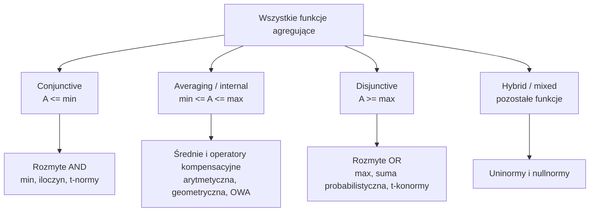

# Means

Means to biblioteka funkcji agregacji dla języka Python.

Dokumentacja:

- [English](https://wgalka.github.io/Means/en/)
- [Polski](https://wgalka.github.io/Means/pl/)

## Klasy funkcji agregujących



Funkcje agregacji dzielą się na:

- **koniunkcyjne** - wynik agregacji pozostaje zależny od najmniejszej wartości wejściowej;
- **dysjunkcyjne** - wynik agregacji pozostaje zależny od największej wartości wejściowej.

## Instalacja

```bash
python -m pip install aggregationslib
```

## Szybki przykład

```python
from aggregationslib.aggregations import A_amn, A_ar, Combine2Aggregations

data = [0.2, 0.6, 0.7]

func1 = A_amn(p=0.5)
print(func1(data))

func2 = Combine2Aggregations(A_ar(), min)
print(func2(data))
```

Informacje o funkcji agregacji można uzyskać za pomocą metod `__str__()` lub `__repr__()`.

## Zbiory klasyczne i rozmyte

Zbiór klasyczny (*crisp set*) opisuje funkcja przynależności:

`mu_A(x) in {0, 1}`

Element `x` należy do zbioru `A`, gdy `mu_A(x) = 1`, a nie należy do
zbioru, gdy `mu_A(x) = 0`. Nie występują wartości pośrednie, takie jak
`0.3` albo `0.7`.

W zbiorze rozmytym funkcja przynależności może przyjmować wartości z
przedziału `[0, 1]`. Dopełnienie zbioru rozmytego `A` oznacza się zwykle
przez `A^c`, a jego funkcję przynależności definiuje się jako:

`mu_(A^c)(x) = 1 - mu_A(x)`

## Negacje rozmyte

Negacja rozmyta jest funkcją:

`N: [0, 1] -> [0, 1]`.

Odwraca stopień przynależności: im większa jest wartość `x`, tym mniejsza
powinna być wartość `N(x)`. Typowo wymaga się także `N(0) = 1` oraz `N(1) = 0`.

Typowe przykłady negacji rozmytych:

- `N(x) = 1 - x` - klasyczna lub standardowa negacja rozmyta. Jest to
  negacja silna, ponieważ spełnia warunek `N(N(x)) = x`;
- `N(x) = 1 - x^2` - negacja ścisła, ale nie silna. Nie jest bowiem
  involucją, czyli na ogół `N(N(x)) != x`.

Rodzina negacji (silnych) Sugeno ma postać:

`N_lambda^S(x) = (1 - x) / (1 + lambda*x)`

gdzie `lambda ∈ (-1, ∞)` oraz `x ∈ [0, 1]`. Dla `lambda = 0` otrzymujemy
negację standardową `N(x) = 1 - x`.

## T-normy i t-konormy

Funkcja:

`C: [0, 1]^2 -> [0, 1]`

bierze dwie liczby od `0` do `1` i zwraca jedną liczbę z tego samego
przedziału. Może formalizować rozmyte „i” albo rozmyte „lub”.

### Rozmyte „i” - koniunkcja

Rozmyta koniunkcja powinna zachowywać się jak logiczne AND dla wartości
klasycznych:

- `C(1, 1) = 1`;
- `C(0, 0) = C(0, 1) = C(1, 0) = 0`.

Klasycznym przykładem jest:

`C(a, b) = min(a, b)`.

Na przykład `C(0.4, 0.8) = 0.4`.

### Rozmyte „lub” - alternatywa

Rozmyta alternatywa powinna zachowywać się jak logiczne OR:

- `S(0, 0) = 0`;
- `S(1, 0) = S(0, 1) = S(1, 1) = 1`.

Klasycznym przykładem jest:

`S(a, b) = max(a, b)`.

Na przykład `S(0.4, 0.8) = 0.8`.

### Monotoniczność

Funkcja jest rosnąca w każdym argumencie, jeśli zwiększenie argumentu nie
zmniejsza wyniku. Jeżeli `a <= a'`, to powinno zachodzić:

`C(a, b) <= C(a', b)`.

Większy stopień prawdziwości na wejściu nie może więc prowadzić do mniejszego
wyniku.

### Seminormy i normy triangularne

Koniunkcja rozmyta staje się triangularną seminormą, gdy `1` jest jej
elementem neutralnym:

`C(a, 1) = a`.

Dołączenie pełnej prawdy nie zmienia wyniku, np. `min(0.7, 1) = 0.7`.

Odpowiednik dla alternatywy, nazywany triangularną semikonormą lub
t-semikonormą, ma element neutralny `0`:

`S(a, 0) = a`.

Seminorma staje się t-normą, jeśli dodatkowo jest przemienna:

`C(a, b) = C(b, a)`

oraz łączna:

`C(C(a, b), c) = C(a, C(b, c))`.

Dla t-konormy obowiązują analogiczne własności, ale reprezentuje ona rozmyte
„lub”. Najprościej zapamiętać:

- **t-norma** jest rozmytym odpowiednikiem AND;
- **t-konorma** jest rozmytym odpowiednikiem OR.

Najbardziej klasyczne przykłady to:

`T(a, b) = min(a, b)` oraz `S(a, b) = max(a, b)`.

## Definicja średniej

Średnia `n` niezależnych zmiennych `x_1, ..., x_n` jest funkcją
`M(x_1, ..., x_n)`, która jest **wewnętrzna**. Oznacza to, że jej wynik
znajduje się pomiędzy najmniejszą i największą wartością wejściową:

`min(x_1, ..., x_n) <= M(x_1, ..., x_n) <= max(x_1, ..., x_n)`.

Innymi słowy, średnia nie może być mniejsza od minimum ani większa od
maksimum argumentów.

## Własności średniej `M_n`

Średnia:

`M_n: [a, b]^n -> [a, b]`

bierze `n` liczb z przedziału `[a, b]` i zwraca jedną liczbę z tego samego
przedziału. Typowa średnia powinna mieć następujące własności:

1. **Ciągłość** - mała zmiana danych powoduje małą zmianę wyniku.

2. **Symetria** - kolejność argumentów nie ma znaczenia. Dla dowolnego
   przestawienia `alpha`:

   `M_n(x_1, ..., x_n) = M_n(x_(alpha(1)), ..., x_(alpha(n)))`.

   Na przykład `M_3(2, 5, 8) = M_3(8, 2, 5)`.

3. **Ścisła monotoniczność względem każdego argumentu** - jeśli zwiększymy
   jeden argument, pozostawiając pozostałe bez zmian, wynik również powinien
   wzrosnąć.

4. **Idempotentność** - gdy wszystkie argumenty są takie same, średnia jest
   równa tej wspólnej wartości:

   `M_n(x, ..., x) = x`.

5. **Niezmienniczość po uśrednieniu grupy argumentów** - jeśli

   `x = M_k(x_1, ..., x_k)`,

   to pierwsze `k` argumentów można zastąpić `k` kopiami ich średniej bez
   zmiany wyniku:

   `M_n(x_1, ..., x_k, x_(k+1), ..., x_n)`

   `= M_n(x, ..., x, x_(k+1), ..., x_n)`.

   Dla zwykłej średniej:

   `x = (2 + 4) / 2 = 3`,

   więc `M_3(2, 4, 10) = M_3(3, 3, 10) = 16/3`.

## Średnia quasi-arytmetyczna

Jeśli średnia `M_n` spełnia powyższe własności, można ją przedstawić w
postaci średniej quasi-arytmetycznej:

`M_n(x_1, ..., x_n) = f^(-1)((1/n) * sum_(i=1)^n f(x_i))`.

Obliczenie przebiega w trzech krokach:

1. przekształcamy każdą wartość za pomocą `f`: `x_i -> f(x_i)`;
2. liczymy zwykłą średnią arytmetyczną przekształconych wartości:
   `(1/n) * sum_(i=1)^n f(x_i)`;
3. stosujemy funkcję odwrotną `f^(-1)`, aby wrócić do pierwotnej skali.

Schemat można zapisać jako:

`x_i -> f(x_i) -> (1/n) * sum f(x_i) -> f^(-1) -> M_n`.

Dla `f(x) = x` otrzymujemy średnią arytmetyczną:

`M_n(x_1, ..., x_n) = (x_1 + ... + x_n) / n`.

Dla dodatnich wartości i `f(x) = ln(x)`, gdzie `f^(-1)(x) = exp(x)`, otrzymujemy
średnią geometryczną:

`M_n = exp((1/n) * sum_(i=1)^n ln(x_i))`.

Wybór innej funkcji `f` prowadzi więc do innego rodzaju średniej.

Funkcja generująca średnią nie jest jednoznaczna. Jeśli:

`g(x) = alpha*f(x) + beta`, gdzie `alpha != 0`,

to funkcje `f` i `g` definiują tę samą średnią quasi-arytmetyczną. Oznacza to,
że przeskalowanie funkcji i przesunięcie jej o stałą nie zmienia wyniku.
Dlatego średnia quasi-arytmetyczna jest izomorficzna ze średnią arytmetyczną
po odpowiednim przekształceniu skali przez `f`.

## Ważona średnia quasi-arytmetyczna

W średniej quasi-arytmetycznej wszystkie argumenty mają takie same wagi
`w_i = 1/n`. Można jednak dopuścić różne wagi i otrzymać ważoną średnią
quasi-arytmetyczną, nazywaną także średnią quasi-liniową:

`M_n(x_1, ..., x_n) = f^(-1)(sum_(i=1)^n w_i*f(x_i))`.

Wagi muszą spełniać warunki:

`w_i > 0` oraz `sum_(i=1)^n w_i = 1`.

Jeśli `f(x) = x`, `x_1 = 10`, `x_2 = 20`, `w_1 = 0.8` i `w_2 = 0.2`, to:

`M = 0.8*10 + 0.2*20 = 12`.

Pierwsza wartość ma większy wpływ na wynik, ponieważ otrzymała większą wagę.
Taka średnia nie musi być symetryczna. Po zamianie wartości miejscami, przy
pozostawieniu wag przypisanych do pozycji, otrzymujemy:

`M(10, 20) = 0.8*10 + 0.2*20 = 12`,

ale:

`M(20, 10) = 0.8*20 + 0.2*10 = 18`.

Zatem `M(10, 20) != M(20, 10)`. Wagi pozwalają określić, które argumenty są
ważniejsze, ale przez to kolejność argumentów może wpływać na wynik.

## Średnie Lehmera

Średnia Lehmera rzędu `r` ma postać:

`L^(r)(x_1, ..., x_n) = (sum_(k=1)^n w_k*x_k^r) / (sum_(k=1)^n w_k*x_k^(r-1))`.

Wagi spełniają warunki `w_k > 0` oraz `sum_(k=1)^n w_k = 1`. Parametr `r`
określa, jak silnie średnia faworyzuje większe wartości. Dla równych wag
można przyjąć `w_k = 1/n`.

Najważniejsze przypadki to:

- `L^(1) = A` - średnia arytmetyczna;
- `L^(0) = H` - średnia harmoniczna;
- dla dwóch argumentów i równych wag `L^(1/2) = G` - średnia geometryczna;
- `L^(2)` - średnia kontraharmoniczna.

Dla `r = 2` otrzymujemy:

`L^(2)(x_1, ..., x_n) = (sum w_k*x_k^2) / (sum w_k*x_k)`.

Na przykład dla `2` i `8` z wagami `1/2`:

`L^(2)(2, 8) = ((1/2)*2^2 + (1/2)*8^2) / ((1/2)*2 + (1/2)*8) = 34/5 = 6.8`.

Średnie Lehmera są niemalejące względem parametru `r`:

`r <= s  =>  L^(r) <= L^(s)`.

Dla wartości `2` i `8` otrzymujemy między innymi:

`L^(0) = 3.2`, `L^(1/2) = 4`, `L^(1) = 5`, `L^(2) = 6.8`.

Widać więc, że większe `r` zwiększa nacisk na większe wartości. Dla średnich
potęgowych `P^(r)` zachodzą zależności:

- `r <= 1  =>  L^(r) <= P^(r)`;
- `r >= 1  =>  P^(r) <= L^(r)`.

Obie rodziny spotykają się dla `r = 1`.

## Operator OWA

OWA (*Ordered Weighted Averaging*) oznacza **uporządkowaną średnią ważoną**.
Operator:

`M: [0, 1]^n -> [0, 1]`

ma wagi `w = (w_1, ..., w_n)` spełniające:

`w_i ∈ [0, 1]` oraz `sum_(i=1)^n w_i = 1`.

Najważniejsze jest to, że wartości najpierw porządkujemy malejąco:

`y_1 >= y_2 >= ... >= y_n`,

a dopiero potem przypisujemy wagi do pozycji:

`M(x_1, ..., x_n) = sum_(i=1)^n w_i*y_i`.

Przykład: dla `x = (0.2, 0.9, 0.5)` po uporządkowaniu otrzymujemy
`y = (0.9, 0.5, 0.2)`. Dla wag `w = (0.5, 0.3, 0.2)`:

`M = 0.5*0.9 + 0.3*0.5 + 0.2*0.2 = 0.64`.

Szczególne przypadki:

- `w = (1, 0, ..., 0)` daje maksimum: `M = max(x_1, ..., x_n)`;
- `w = (0, ..., 0, 1)` daje minimum: `M = min(x_1, ..., x_n)`;
- `w_i = 1/n` daje zwykłą średnią arytmetyczną;
- skupienie całej wagi na pozycji środkowej daje medianę.

Dla nieparzystego `n` mediana ma postać `y_((n+1)/2)`, a dla parzystego:

`(y_(n/2) + y_(n/2+1)) / 2`.

OWA może także realizować agregację olimpijską. Wtedy odrzucamy największą
i najmniejszą wartość (`w_1 = w_n = 0`), a pozostałym wartościom przypisujemy
wagę `1/(n-2)`. Dla wyników `(10, 9, 8, 6, 2)` odrzucamy `10` i `2`, więc
pozostają `9, 8, 6`.

Najkrócej: **OWA = uporządkuj wartości -> przypisz wagi do pozycji -> zsumuj**.
W odróżnieniu od zwykłej średniej ważonej waga nie jest przypisana do
konkretnego `x_i`, lecz do jego pozycji po uporządkowaniu.

### Wykresy 3D

Poniższa plansza pokazuje powierzchnie 3D wszystkich publicznych klas `A_*`
z biblioteki. Zakres jest dobierany osobno dla każdej funkcji, dlatego część
wykresów pokazuje wartości spoza `[0,1]`, a funkcje wymagające dodatnich
argumentów są rysowane na dziedzinie dodatniej:


Wykres można odtworzyć poleceniem:

```powershell
python .\generate_aggregation_plots.py
```

Każdy wykres jest również dostępny osobno w
[`docs/aggregation-plots.md`](docs/aggregation-plots.md), pod nazwą swojej
funkcji, np. `A_amx`.

OWA jest zwykle symetryczny, monotoniczny i idempotentny. W niektórych
ujęciach rozważa się także dodatkową własność skalowania i przesunięcia,
zapisywaną w przybliżeniu jako:

`M(r*x_1 + t_1, ..., r*x_n + t_n) = r*M(x_1, ..., x_n) + M(t_1, ..., t_n)`.

Jest to własność opisująca przewidywane, „liniowe” zachowanie operatora po
przekształceniu danych. Jej dokładny zakres zależy od dodatkowych założeń,
na przykład od sposobu uporządkowania argumentów.

## Funkcja agregująca

Funkcja agregująca jest szerszym pojęciem niż średnia. W ogólnej postaci może
być określona jako:

`M: R^n -> R`.

Powinna spełniać dwie podstawowe własności:

1. **Monotoniczność** - jeśli wszystkie argumenty zwiększą się lub pozostaną
   bez zmian, wynik nie może się zmniejszyć. Jeżeli `x_i <= y_i` dla każdego
   `i`, to:

   `M(x_1, ..., x_n) <= M(y_1, ..., y_n)`.

2. **Idempotentność** - jeśli wszystkie argumenty są takie same, wynik jest
   równy tej wspólnej wartości:

   `M(x, ..., x) = x`.

Przykładowo, jeśli `M(2, 4, 6) = 4`, to po zwiększeniu jednego argumentu do
`M(2, 5, 6)` wynik nie powinien być mniejszy niż `4`. Natomiast:

`M(0.7, 0.7, 0.7) = 0.7`.

Średnie arytmetyczne, quasi-arytmetyczne, ważone oraz operatory OWA mogą być
funkcjami agregującymi, jeśli spełniają te warunki. W zależności od definicji
i dziedziny średnie Lehmera nie zawsze są monotoniczne względem każdego
argumentu, więc nie zawsze spełniają tę konkretną definicję funkcji
agregującej.

W teorii zbiorów rozmytych najczęściej stosuje się dziedzinę `[0, 1]`, ponieważ
wartości w tym przedziale opisują stopień przynależności lub prawdziwości:

`M: [0, 1]^n -> [0, 1]`.

## Dodatkowe własności funkcji agregującej

### Bisymetryczność

Funkcja `A` jest bisymetryczna, jeśli agregowanie wierszy, a następnie
otrzymanych wyników daje to samo co agregowanie kolumn, a następnie tych
wyników. Dla macierzy wartości `x_(ij)` oznacza to schematycznie:

`A(A(x_11, ..., x_1n), ..., A(x_n1, ..., x_nn))`

`= A(A(x_11, ..., x_n1), ..., A(x_1n, ..., x_nn))`.

Można to zapamiętać jako: **wiersze -> A daje ten sam wynik co kolumny -> A**.

### Element neutralny

Element `e` jest neutralny, jeśli jego dodanie nie zmienia wyniku. Dla funkcji
dwuargumentowej:

`A(x, e) = x`.

Przykłady:

- `1` jest elementem neutralnym mnożenia, ponieważ `x*1 = x`;
- `0` jest elementem neutralnym maksimum na `[0, 1]`, ponieważ
  `max(x, 0) = x`.

W przypadku funkcji wieloargumentowej wstawienie `e` nie wpływa na wynik,
choć po usunięciu elementu neutralnego pozostaje o jeden argument mniej.

### Element zerowy lub pochłaniający

Element `z` jest pochłaniający, jeśli jego wystąpienie wymusza wynik `z`:

`A(..., z, ...) = z`.

Na przykład `0` jest pochłaniaczem mnożenia, bo `x*0 = 0`, oraz funkcji
minimum na `[0, 1]`, bo `min(x, 0) = 0`.

### Brak dzielników zera

Funkcja nie ma dzielników zera, jeśli:

`A(x_1, ..., x_n) = z  =>  istnieje k: x_k = z`.

Oznacza to, że jeśli wynik jest równy elementowi pochłaniającemu `z`, to
przynajmniej jeden argument musiał być równy `z`. Symbol `∃` oznacza
„istnieje”. Dla mnożenia: `x*y = 0` oznacza `x = 0` lub `y = 0`.

## Klasy funkcji agregujących

Funkcje agregujące można klasyfikować według ich położenia względem minimum
i maksimum argumentów:

- **conjunctive** - `A <= min`, czyli wynik nie jest większy od najmniejszego
  wejścia; odpowiada to rozmytemu „i”;
- **disjunctive** - `A >= max`, czyli wynik jest co najmniej tak duży jak
  największe wejście; odpowiada to rozmytememu „lub”;
- **averaging** - `min <= A <= max`, czyli wynik leży pomiędzy minimum i
  maksimum;
- **hybrid/mixed** - funkcja nie spełnia żadnego z powyższych trzech warunków
  w całej swojej dziedzinie.

Dla argumentów `2, 5, 8` funkcja averaging musi spełniać:

`2 <= A(2, 5, 8) <= 8`.

Średnia arytmetyczna daje w tym przykładzie `5`.

Wizualny schemat klas agregacji znajduje się w pliku
[`docs/aggregation-classes.md`](docs/aggregation-classes.md).

## Funkcja dualna i samodualność

Dla funkcji:

`F: [0, 1]^n -> [0, 1]`

funkcję dualną definiuje się jako:

`F^d(x_1, ..., x_n) = 1 - F(1-x_1, ..., 1-x_n)`.

Obliczenie funkcji dualnej przebiega w trzech krokach:

1. zamieniamy każde `x_i` na `1-x_i`;
2. obliczamy funkcję `F` dla tych wartości;
3. odejmujemy otrzymany wynik od `1`.

Jeśli `F(x, y) = min(x, y)`, to:

`F^d(x, y) = 1 - min(1-x, 1-y) = max(x, y)`.

Dlatego minimum i maksimum są operacjami dualnymi, podobnie jak rozmyte
„i” oraz „lub”.

Funkcja jest **samodualna** (*self-dual*), jeśli jest równa swojej funkcji
dualnej:

`F(x_1, ..., x_n) = 1 - F(1-x_1, ..., 1-x_n)`.

Przykładem jest średnia arytmetyczna:

`1 - ((1-x) + (1-y))/2 = (x+y)/2`.

Najkrócej: funkcja dualna odwraca wejścia, oblicza `F`, a następnie odwraca
wynik. Funkcja samodualna po takim przekształceniu pozostaje tą samą funkcją.

## Operacje na zbiorach rozmytych

Symbole `∨` i `∧` oznaczają odpowiedniki logicznego „lub” i „i”. Dla
zbiorów rozmytych, przy standardowych operatorach maksimum i minimum:

`(A ∨ B)(x) = max(A(x), B(x))`

`(A ∧ B)(x) = min(A(x), B(x))`, dla `x ∈ X`.

Dla zwykłych zbiorów:

- `x ∈ A ∪ B` oznacza, że `x` jest w zbiorze `A` lub w zbiorze `B`;
- `x ∈ A ∩ B` oznacza, że `x` jest jednocześnie w zbiorze `A` i w zbiorze `B`.

W zbiorach rozmytych wartości przynależności mogą być pośrednie, na przykład
`A(x) = 0.3` i `B(x) = 0.8`. Dlatego:

- rozmyte „A lub B” przyjmuje większą wartość: `max(0.3, 0.8) = 0.8`;
- rozmyte „A i B” przyjmuje mniejszą wartość: `min(0.3, 0.8) = 0.3`.

Można więc traktować `∨` jako rozmyty odpowiednik sumy zbiorów, a `∧` jako
rozmyty odpowiednik części wspólnej zbiorów.

## Relacje rozmyte

Szczególnym przypadkiem zbiorów rozmytych są **relacje rozmyte**. Relacja
rozmyta jest zbiorem rozmytym określonym na iloczynie kartezjańskim, na
przykład `X × Y`. Jej funkcja przynależności przypisuje stopień powiązania
parze `(x, y)`:

`mu_R(x, y) in [0, 1]`.

Relację rozmytą można zapisać jako:

`R: X x Y -> [0, 1]`.

Oznacza to, że `R` jest relacją rozmytą między zbiorami `X` i `Y`. Jej
dziedziną są wszystkie pary `(x, y)`, gdzie `x ∈ X` oraz `y ∈ Y`, a relacja
`R` przypisuje każdej takiej parze liczbę z przedziału `[0, 1]`.

Na przykład `R(x, y) = 0.8` oznacza, że para `(x, y)` należy do relacji w
stopniu `0.8`. Innymi słowy: wybieramy `x` z `X` i `y` z `Y`, a wartość
`R(x, y)` określa, jak silnie są ze sobą powiązane.

## Symbol `∘`

Symbol `∘` oznacza **złożenie** albo **kompozycję**. Kompozycja to połączenie
dwóch działań w taki sposób, że wynik pierwszego działania staje się wejściem
drugiego.

Dla funkcji `f` i `g` zapis:

`(g ∘ f)(x) = g(f(x))`

oznacza, że najpierw stosujemy funkcję `f`, a następnie funkcję `g`.
Na przykład, jeśli `f(x) = x + 1` oraz `g(x) = 2x`, to:

`(g ∘ f)(3) = g(f(3)) = g(4) = 8`.

Dla relacji rozmytych symbol `∘` może oznaczać ich kompozycję. W standardowej
kompozycji max-min:

`(R ∘ S)(x, z) = max_y min(R(x, y), S(y, z))`.

Czyli dla wszystkich możliwych elementów pośrednich `y` wybieramy najpierw
minimum stopni powiązania, a następnie największą z otrzymanych wartości.

## Operator agregacji

Operator agregacji bierze dwie wartości z przedziału `[0, 1]` i łączy je w
jedną wartość, również należącą do przedziału `[0, 1]`:

`A: [0, 1] x [0, 1] -> [0, 1]`.

Czyli dla `a, b ∈ [0, 1]` wartość `A(a, b)` jest pojedynczym wynikiem
agregacji. W przypadku większej liczby argumentów zapis można uogólnić do:

`A: [0, 1]^n -> [0, 1]`.

## Symbol `×`

Symbol `×` może oznaczać zwykłe mnożenie, ale w zapisie zbiorów często
oznacza **iloczyn kartezjański**. Na przykład:

`[0, 1] × [0, 1]`

to zbiór wszystkich uporządkowanych par `(a, b)`, dla których
`a ∈ [0, 1]` oraz `b ∈ [0, 1]`. Dlatego zapis

`B: [0, 1]^2 -> [0, 1]`

jest skrótem informacji, że `B` przyjmuje dwie wartości z `[0, 1]` i zwraca
jedną wartość z `[0, 1]`.

## Supremum `sup`

Zapis:

`sup_(y in X) f(y)`

oznacza: weź wszystkie możliwe wartości `y` należące do `X`, oblicz dla nich
wartości funkcji `f(y)`, a następnie wybierz najmniejszą górną granicę
otrzymanego zbioru wartości.

W prostych, skończonych przykładach można to traktować jako „wybierz
największą wartość”. Na przykład:

`sup(0.2, 0.7, 0.5) = 0.7`.

W ogólnym przypadku supremum nie musi być wartością osiąganą przez funkcję,
dlatego jest pojęciem szerszym niż maksimum.

## Infimum `inf` i alternatywne złożenie relacji

Infimum działa podobnie jak supremum, ale wybiera najmniejszą wartość:

`inf(0.2, 0.7, 0.5) = 0.2`.

Dla relacji rozmytych można zdefiniować alternatywne złożenie:

`(R ◁_B W)(x, z) = inf_(y in Y) B(R(x, y), W(y, z))`.

Oznacza to, że:

- bierzesz wszystkie możliwe wartości `y`;
- dla każdej liczysz `B(R(x, y), W(y, z))`;
- wybierasz najmniejszą z otrzymanych wartości.

Symbol `◁_B` oznacza inny rodzaj złożenia relacji, zdefiniowany przez
operator `B` oraz użycie infimum. Jeśli `R ∈ FR(X, Y)` i `W ∈ FR(Y, Z)`,
to elementem pośrednim jest `y ∈ Y`, dlatego zapisujemy `inf_(y in Y)`.

## Funkcje agregacji

Funkcja agregacji [1] jest odwzorowaniem
`A:[0,1]^n -> [0,1]`, gdzie `n >= 2`, które jest rosnące i spełnia warunki brzegowe:
`A(0,...,0) = 0` oraz `A(1,...,1) = 1`.

Biblioteka implementuje między innymi:

- średnią arytmetyczną, kwadratową, geometryczną, harmoniczną i potęgową;
- agregację iloczynową;
- średnią wykładniczą i średnią Lehmera;
- średnią arytmetyczno-minimalną i arytmetyczno-maksymalną;
- medianę oraz agregacje olimpijskie OWA;
- agregację logarytmiczną;
- kombinacje wypukłe funkcji agregacji.

### Przykłady reprezentacji funkcji

```pycon
>>> A_amn(p=0.5)
A_amn(0.5)
>>> Combine2Aggregations(A_ar(), A_md())
A_armd
>>> Combine2Aggregations(A_ar(), A_pw(r=3)).__repr__()
A_arpw(r=3)
```

## Referencje

1. Beliakov, G., Bustince, H. i Calvo, T.: *A Practical Guide to Averaging Functions*.
   Berlin: Springer, vol. 329, 2016.
2. Mustonen, Seppo (2010):
   [Logarithmic mean for several arguments](https://www.researchgate.net/publication/228886844_Logarithmic_mean_for_several_arguments).
3. [Aggregation functions](https://arxiv.org/pdf/2208.01644).
