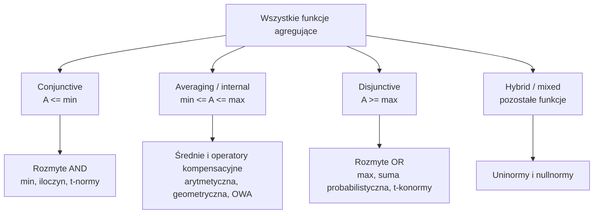
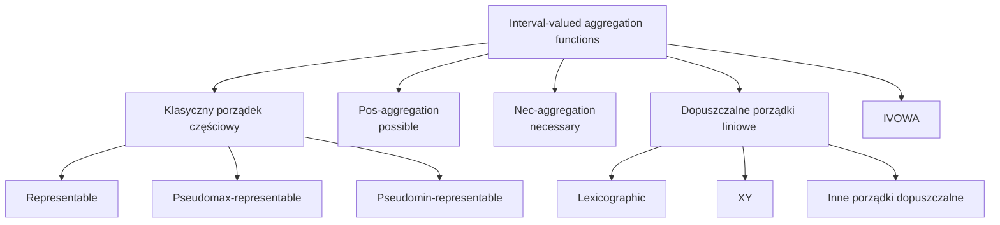
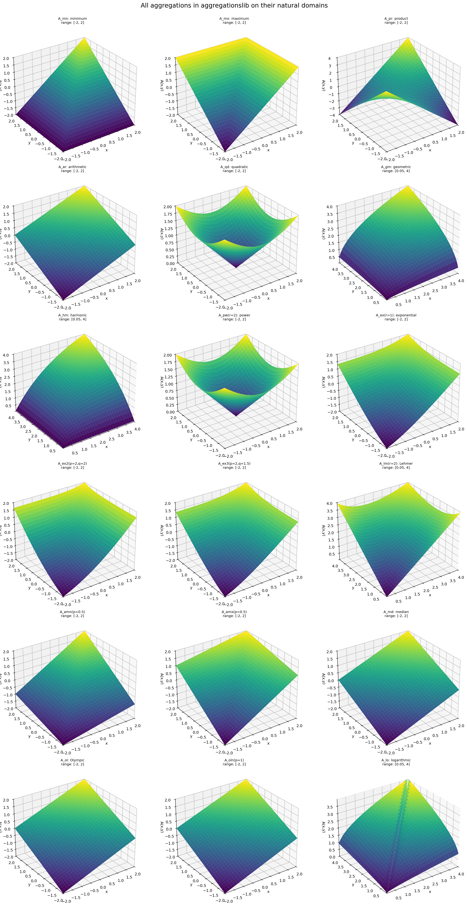

# Klasy funkcji agregujących

## Funkcje agregujące na `[0,1]`

Interpretacja klas:

- `conjunctive`: wynik nie przekracza minimum argumentów;
- `averaging`: wynik leży między minimum i maksimum;
- `disjunctive`: wynik jest co najmniej tak duży jak maksimum argumentów;
- `hybrid/mixed`: funkcja nie należy do żadnej z trzech pozostałych klas.

## Operatory dla wartości przedziałowych

Diagram przedstawia główne rodziny wymienione w rozdziale dotyczącym
agregacji dla wartości przedziałowych. Nie jest to hierarchia zawierania się
wszystkich klas: część rodzin może się przecinać.

## Powierzchnie 3D

Plansza pokazuje, jak różne funkcje przekształcają parę wartości `(x,y)` w
pojedynczy wynik `A(x,y)`. Można ją ponownie wygenerować skryptem
`generate_aggregation_plots.py`.
